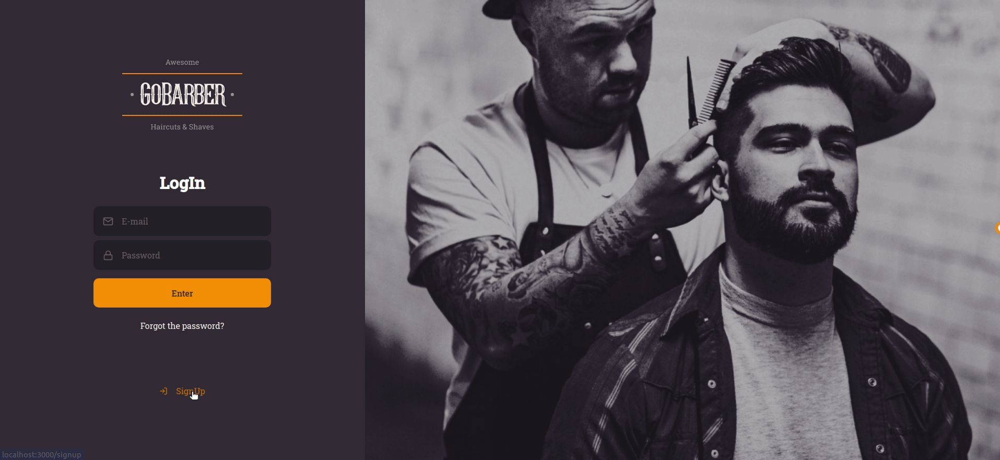
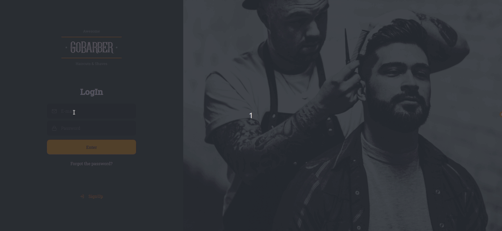

<h3 align="center">
   🌐 GoBarber Web
</h3>

🇺🇸 GoBarber website made at [Bootcamp GoStack](https://rocketseat.com.br/gostack), the Web application was made in ReactJS, using TypeScript behind to help in the development, the website is not entirely ready, but the pages of Login and Registration are ready, the api used is [here](https://github.com/kawaxzx/Go_Barber_BootcampRocketseat/tree/master/Backend%20GoBarber)

🇧🇷 Site do GoBarber feito no [Bootcamp GoStack](https://rocketseat.com.br/gostack), a aplição Web foi feita em ReactJS, usando Typescript por trás para ajudar no desenvolvimento, o site nao esta totalmente pronto, mas as paginas de Login e Cadastro já estão prontas, a api utilizada está [aqui](https://github.com/kawaxzx/Go_Barber_BootcampRocketseat/tree/master/Backend%20GoBarber)

<h3 align="center">📷 SingIn Page 💻</h3>

<h3 align="center">📷 SignUP Page 💻</h3>

<h3 align="center">📷 SignIn Sucess 💻</h3>

