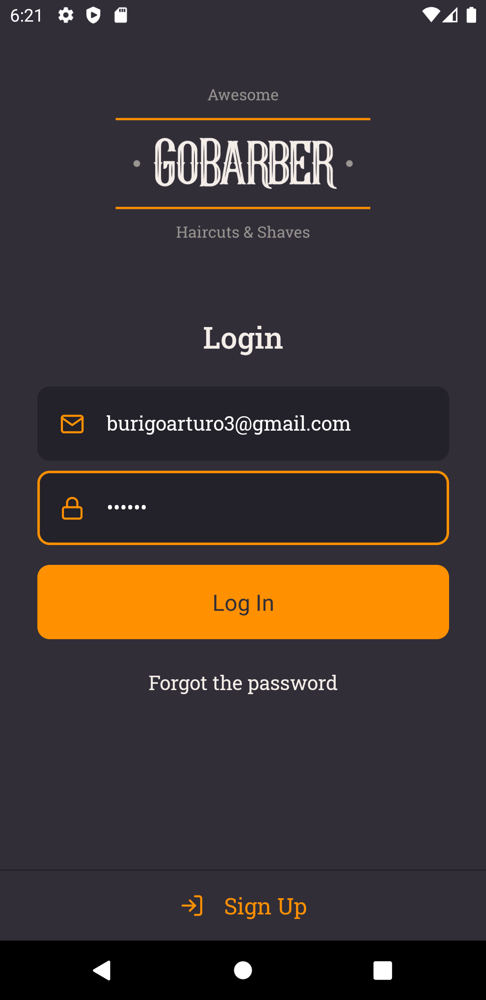
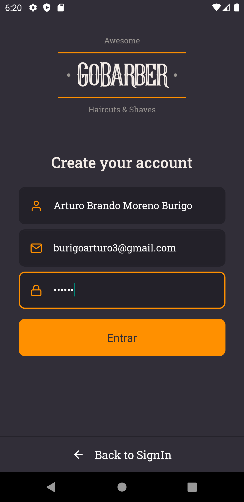
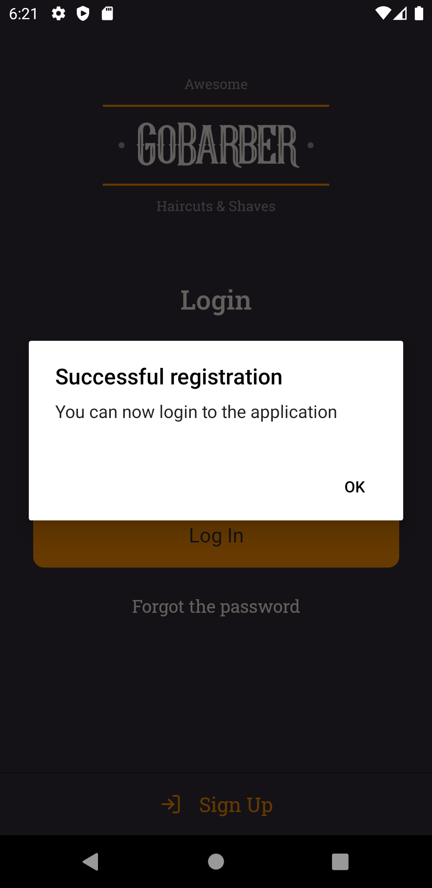
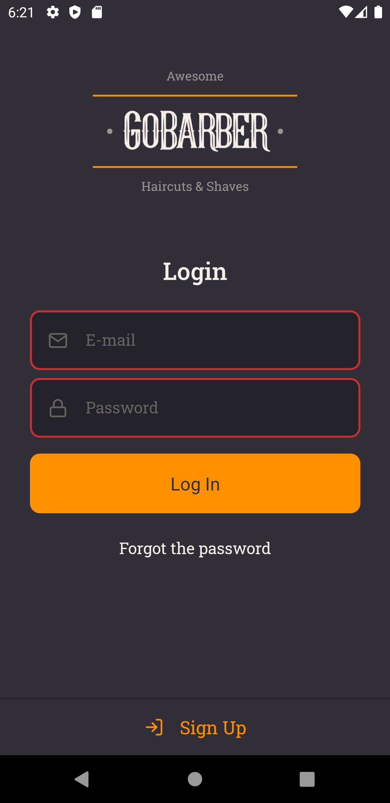
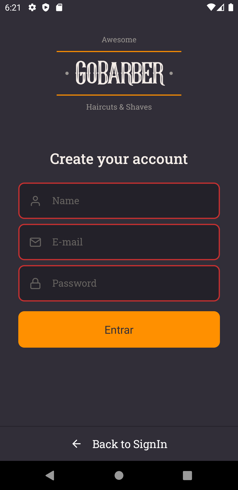

<h3 align="center">
   🌐 GoBarber App
</h3>

🇺🇸 GoBarber app was made at [Bootcamp GoStack](https://rocketseat.com.br/gostack), the Mobile application was made in ReactNative, using TypeScript behind to help in the development, the website is not entirely ready, but the pages of Login and Registration are ready, the api used is [here](https://github.com/kawaxzx/Go_Barber_BootcampRocketseat/tree/master/Backend%20GoBarber)

🇧🇷 App do GoBarber feito no [Bootcamp GoStack](https://rocketseat.com.br/gostack), a aplição mobile foi feita em ReactNative, usando Typescript por trás para ajudar no desenvolvimento, o site nao esta totalmente pronto, mas as paginas de Login e Cadastro já estão prontas, a api utilizada está [aqui](https://github.com/kawaxzx/Go_Barber_BootcampRocketseat/tree/master/Backend%20GoBarber)

<h3 align="center">📷 SingIn Page 💻</h3>

<h3 align="center">📷 SignUP Page 💻</h3>

<h3 align="center">📷 SignIn Sucess 💻</h3>

<h3 align="center">📷 Error SignIn 💻</h3>

<h3 align="center">📷 Error SignUp 💻</h3>

